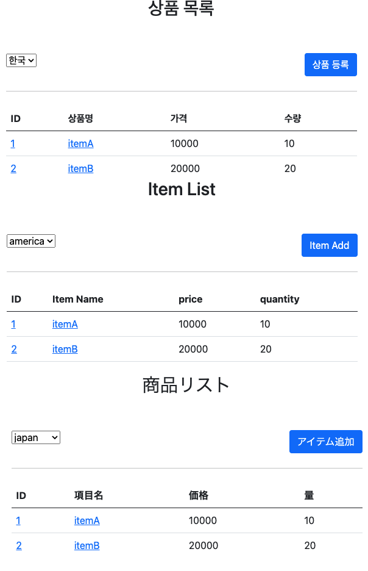

# 스프링 MVC 2편 - 백엔드 웹 개발 활용 기술

인프런 강의를 듣고 필요한 부분과 추가하고 싶은 화면을 재구성하여 정리하였습니다.

## Table Of Contents

- [thymeleaf 뷰템플릿](#thymeleaf-뷰템플릿)
- [다국어 처리 방법](#다국어-처리-방법)
- [로그인 처리](#로그인-처리)
- [유효성 설정](#유효성-설정)
- [업로드](#업로드)
- [예외 처리](#예외-처리)
- [타입 컨버터](#타입-컨버터)

## thymeleaf 뷰템플릿[[코드 보기]](./src/thymeleaf-basic)

thymeleaf 뷰템플릿 기본 사용법에 대한 학습 코드입니다.  
thymeleaf 기본 문법에 대해 간단하게 사용방법을 숙지할 수 있습니다.

[🔝 목차로 돌아가기](#table-of-contents)

## 다국어 처리 방법[[코드 보기]](./src/message)

다국어 처리는 특정 `WebMvcConfigurer`를 이용하여 설정 후 특정 언어에 쿼리스트링을 받아서 처리하면 됩니다.

- 라디오 버튼을 이용하여 다국어 변경 예제 추가  


[🔝 목차로 돌아가기](#table-of-contents)

## 로그인 처리[[코드 보기]](./src/login)

웹의 프로토콜은 클라이언트와 서버와의 관계를 유지하지 않는 Stateless 기반인 프로토콜입니다.  
그렇기 때문에 인증과 관련된 정보를 저장하기 위해서는 세션과 쿠키가 필요합니다.  

- 쿠키를 이용한 로그인 관리(위험)
- 세션값에 회원정보를 저장 후 쿠키에 임의의 값 전송

### 1. Session

세션은 로그인 사용자가 지속적으로 서버에서 세션을 유지해야 합니다  
또한 사용자가 로그아웃 또는 강제 종료 시에는 세션 타임아웃을 설정하여 특정 시간이 지난 후 자동적으로 세션이 삭제되도록 설정해야 합니다.

session timeout 설정 방법

```java
// application.properties
server.servlet.session.timeout=1800
// code
session.setMaxInactiveInterval(1800);
```

session 제거 방법

```java
// 세션 확인 false이면 생성하지 않음
HttpSession session = request.getSession(false);

if (session != null) {
    // 세션 제거
    session.invalidate();
}
```

세션에는 최소한의 데이터만 보관하는게 좋습니다.  
가벼운 서비스에는 그렇게 문제가 되지 않지만 사용자가 많은 서비스의 경우 세션의 메모리가 서버 메모리 사용량에 영향을 많이 끼칠 수 있습니다.

위 방법 이외에 Spring Security, Spring Security Oauth2, JWT(Json Web Token)를 이용한 방법이 있습니다.

### 2. 서블릿 필터

특정 권한의 사용자가 특정 화면에 접근 수정 삭제 하는 공통 관심사(cross-cutting-concern)를 처리 하기 위한 방법으로 AOP 또는 서블릿 필터, 스프링 인터셉터를 이용할 수 있습니다.

#### 로그인 시 가장 마지막 URI링크 연결 하는 방법

1. 필터(`LoginCheckFilter.java`) 파일에 지정한 코드로 가장 마지막 위치의 URI 링크 저장

   ```java
   httpServletResponse.sendRedirect("/login?redirectURL=" + requestURI);
   ```

2. 로그인 컨트롤러(`LoginController.java`)에서 아래의 파라미터에 해당 URI을 전달

    ```java
    @RequestParam(defaultValue = "/") String redirectURL
    redirectURL => http://localhost:8080/login?redirectURL=/items
    ```

이렇게 마지막 화면으로 이동하게 됩니다.

### 3. 인터셉터

`WebConfig.java`파일에서 Interceptor 추가 가능합니다.

```java
@Override
    public void addInterceptors(InterceptorRegistry registry) {
        registry.addInterceptor(new LogInterceptor()) // 인터셉터 등록
                .order(1) // 인터셉터 호출 순서 지정 낮을수록 먼저 호출
                .addPathPatterns("/**") // 인터셉터 적용할 URL 패턴 지정
                .excludePathPatterns("/css/**", "/*.ico", "/error"); // 인터셉터 제외할 패턴 지정
        
        registry.addInterceptor(new LoginCheckInterceptor())
                .order(2)
                .addPathPatterns("/**")
                .excludePathPatterns("/", "/members/add", "/login", "/logout", "/css/**", "/*.ico", "error");
    }
```

- 위와 같이 패턴을 추가 가능
- excludePathPatterns에 대해([공식문서](https://docs.spring.io/spring-framework/docs/current/javadoc-api/org/springframework/web/util/pattern/PathPattern.html))
   1. ? 한 문자 일치
   2. \* 경로(/) 안에서 0개 이상의 문자 일치
   3. ** 경로 끝까지 0개 이상의 경로(/) 일치
   4. {spring} 경로(/)와 일치하고 spring이라는 변수로 캡처
   5. {spring:[a-z]+} matches the regexp [a-z]+ as a path variable named "spring"
   6. {spring:[a-z]+} regexp [a-z]+ 와 일치하고, "spring" 경로 변수로 캡처
   7. {*spring} 경로가 끝날 때 까지 0개 이상의 경로(/)와 일치하고 spring이라는 변수로 캡처

### 4. ArgumentResolver

로그인 객체를 한번에 받아올 수 있는 방법입니다.  
`WebConfig.java` 파일에 해당 객체를 추가해주면 됩니다.

```java
    @Override
    public void addArgumentResolvers(List<HandlerMethodArgumentResolver> resolvers) {
        resolvers.add(new LoginMemberArgumentResolver());
    }
```

해당 설정으로 로그인 세션 정보가 남아 있다면 기본페이지('/') 접근 시 `addArgumentResolvers` 메서드를 통해 등록 된 `LoginMemberArgumentResolver` 
클래스가 호출되어 세션 로그인 유무를 확인할 수 있습니다.

[🔝 목차로 돌아가기](#table-of-contents)

## 유효성 설정[[코드 보기]](./src/validation)

일반적으로 Backend의 유효성 처리는 Frontend에서 유효성처리가 돼 있어도 다시 한번 처리하는 것이 좋습니다.  
Frontend의 경우는 매우 다양한 방법으로 유효성을 회피하여 Backend로 접근할 수 있기 때문입니다.

### 1. FieldError 생성자

`FiledError`는 두가지 생성자 제공

```java
public FieldError(String objectName, String field, String defaultMessage);
public FieldError(String objectName, String field, @Nullable Object rejectedValue,
        boolean bindingFailure, @Nullable String[] codes, @Nullable Object[] arguments,
        @Nullable String defaultMessage
);
```

- objectName : 오류가 발생한 객체 이름
- field : 오류 필드
- rejectedValue : 사용자가 입력한 값(거절된 값)
- bindingFailure : 타입 오류 같은 바인딩 실패인지, 검증 실패인지 구분 값
- codes : 메시지 코드
- arguments : 메시지에서 사용하는 인자
- defaultMessage : 기본 오류 메시

일반적으로 실무에서는 위의 방법을 쓰지는 않으며, DTO쪽에서 Valid 애노테이션 처리 후 컨트롤러에서 에러 메시지를 만들거나 Global로 
해당 에러들을 관리하는 클래스를 작성하여 관리하는 것이 좋다고 생각한다.

### 2. Bean Validation

API의 호출 요청을 받는 객체에서 애노테이션을 통해 유효성 검사를 하는 방식.  
Bean Validation은 특정한 구현체가 아니라 Bean Validation 2.0(JSR-380)이라는 기술 표준

### 3. @Valid @Validated 차이

`@Validated`는 스프링 전용 검증 어노테이션이고, `@Valid`는 자바 표준 검증 어노테이션이다.  
아무거나 사용해도 되지만 `@Validated`의 groups라는 기능을 포함하기 때문에 `groups`를 사용하고 싶다면 `@Validated`를 사용해야 한다.

```java
// DTO
@NotBlank(groups = {SaveCheck.class, UpdateCheck.class})
private String itemName;

@NotNull(groups = {SaveCheck.class, UpdateCheck.class})
@Max(value = 9999, groups = SaveCheck.class)
private Integer quantity;

// Controller
@PostMapping("/{itemId}/edit")
public String editV2(@PathVariable Long itemId, @Validated(UpdateCheck.class) @ModelAttribute Item item,
        BindingResult bindingResult) {
    ...
        }
```

위의 방법처럼 DTO에 경우를 두어 생성과 수정에서 경우를 나눌 수도 있다.(**자주 사용 안함**)  
일반적으로 각각 요청에 따른 DTO를 만드는게 복잡도를 낮추는게 좋다. 요청에 따른 DTO 생성이 바람직하다.

```java
@Getter
@Setter
public class ItemSaveRequestDto {

    @NotBlank
    private String itemName;

    @NotNull
    @Range(min = 1000, max = 1000000)
    private Integer price;

    @NotNull
    @Max(value = 9999)
    private Integer quantity;

    public Item toEntity() {
        return Item.builder()
                .itemName(itemName)
                .price(price)
                .quantity(quantity)
                .build();
    }

}
```

이런식으로 DTO 객체를 만들어서 로직별로 나누는 것이 관리하기도 편리합니다.

[🔝 목차로 돌아가기](#table-of-contents)

## 업로드[[코드보기]](./src/upload)

업로드 기능에 관한 정보입니다.  
다운로드 경로는 해당 **프로젝트 내부**의 `photo`폴더에 생성되도록 했습니다.

이미지 업로드의 경우는 `multipart/form`을 이용해서 전송해야 합니다.  

### 1. image view

ViewTemplate에서 해당 API를 호출하여 이미지 정보를 가져오는 방식입니다.  
이렇게 되면 이미지만큼 API를 호출하게 됩니다.

```java
@ResponseBody
@GetMapping("/images/{filename}")
public Resource downloadImage(@PathVariable String filename) throws MalformedURLException {
    return new UrlResource("file:" + fileStore.getFullPath(filename));
}
```

아래의 코드도 같은 방식으로 동작합니다.

```java
@ResponseBody
@GetMapping(value = "images/{filename}")
public byte[] getImage(@PathVariable(value = "filename") String filename) throws IOException {
    File serverFile = new File(fileStore.getFullPath(filename));
    return Files.readAllBytes(serverFile.toPath());
}
```

이 경우 frontend가 분리(Vue.js, React.js)돼 있다면 frontend에서는 리스트를 불러온 후 각각의 이미지를 전부
 호출 해야하는건지 확인이 필요합니다.

### 2. 특정 폴더 허용 image view

두 번째 방법은 특정 폴더를 설정을 통해 허용하는 방법입니다.  
업로드 폴더를 정적리소스로 허용하는 방법입니다.

```java
@Configuration
public class ResourceConfig implements WebMvcConfigurer {

    @Override
    public void addResourceHandlers(final ResourceHandlerRegistry registry) {
        registry.addResourceHandler("/photo/**").addResourceLocations("file:photo/");
    }
}
```

위의 경우는 파일명이 랜덤이라도 사용자가 특정 파일을 알고 있다면 언제든지 접근이 가능합니다.  
그렇기 때문에 보안에 취약합니다.  
그렇지만 애초에 정적리소스로 해당 폴더를 허용했기 때문에 보안에 취약할 수 있습니다.

위 2가지 방법 중 괜찮은 방법과 보안과 관련하여 시큐리티 설정 또는 인터셉터로 체크를 하는 식으로
 고민이 필요합니다.

[🔝 목차로 돌아가기](#table-of-contents)

## 예외 처리[[코드보기]](./src/exception)

스프링에서는 일반적으로 예외처리에 대해 알 수 있습니다.

- 기본적으로 `WebServerCustomizer.java`처럼 커스텀 하지 않으면 스프링 부트에서 기본 에러페이지를 매핑 제공  
- templates -> error 페이지 정의

에러 페이지는 로그로 남기는게 좋으며, 사용자에게 굳이 어떠한 에러에 대한 정보인지를 보여주는 것은 좋지 않습니다.

에러 처리는 HTTP 상태코드를 프론트에 전해주거나 `ControllerAdvice`로 정제하여 페이지를 호출하는 경우가 있습니다.

### 1. ExceptionResolver

`ExceptionResolver`는 스프링에서 예외를 처리하는 방식을 변경 할 수 있습니다.  
서블릿 컨테이너까지 예외가 전달되지 않으며, 특정 조건인 경우 어떠한 에러를 처리할 지 설정 할 수 있습니다.

#### ExceptionResolver 활용 예

- 예외 상태 코드 변환
- 뷰 템플릿 처리
- API 응답 처리

### 2. ControllerAdvice

`ExceptionResolver`들을 한번에 관리할 수 있도록 도와주는 어노테이션입니다.  
아래와 같이 대상 컨트롤러를 지정하여 처리([공식문서](https://docs.spring.io/spring-framework/docs/current/reference/html/web.html#mvc-ann-controller-advice)) 할 수 있습니다.

```java
    // Target all Controllers annotated with @RestController
    @ControllerAdvice(annotations = RestController.class)
    public class ExampleAdvice1 {}

    // Target all Controllers within specific packages
    @ControllerAdvice("org.example.controllers")
    public class ExampleAdvice2 {}

    // Target all Controllers assignable to specific classes
    @ControllerAdvice(assignableTypes = {ControllerInterface.class, AbstractController.class})
    public class ExampleAdvice3 {}
```

### 3. 관련 링크

1. Exception 처리 전략과 관련하여 아래의 링크가 도움이 될 수 있습니다.
    - Yun Blog - [Spring Guide - Exception 전략](https://cheese10yun.github.io/spring-guide-exception/)

[🔝 목차로 돌아가기](#table-of-contents)

## 타입 컨버터[[코드 보기]](./src/typeconverter)

특정한 타입을 원하는 형태로 변경해주는 인터페이스 기능입니다.  
`Converter`를 쓰는 경우에 대해 조금은 생각해 볼 필요가 있겠지만.. 이러한 기능이 있다 정도로 생각해도 좋을 것 같습니다.  
`Formatter`도 Locale 정보를 받아도 어떠한 경우에 유용하게 쓸 수 있을지 고민이 필요해 보입니다.  
오히려 message에서 다국어처리로 처리하는게 더 깔끔하지 않을까 생각도 됩니다.

### 1. Converter 인터페이스

특정한 객체를 원하는 형태로 변경할 수 있습니다.

### 2. Formatter 인터페이스

Locale 정보를 받기 때문에 다국화에 대응할 수 있습니다.

[🔝 목차로 돌아가기](#table-of-contents)
